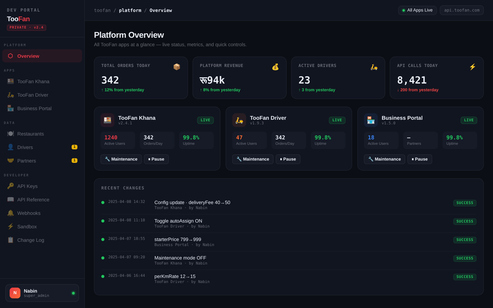

# TooFan — food & parcel delivery platform for Kathmandu

TooFan is a full-stack delivery platform: customers order from local restaurants, drivers get
dispatched jobs in real time, restaurants manage menus and orders, and an internal dev portal
controls pricing, surge zones and maintenance mode across all three apps.



## Who it's for

| App | User | What they do |
|-----|------|--------------|
| **TooFan Khana** | Customers in Kathmandu | Browse restaurants, order, pay with eSewa / Khalti / wallet, track the driver live, chat |
| **TooFan Driver** | Delivery riders | Go online, receive and accept job offers, share location, see earnings |
| **Business Portal** | Restaurant owners & partners | Manage menu items, accept and prepare orders |
| **Dev Portal** (`/dev`) | Platform admins | Live metrics, config changes (fees, per-km rate), surge zones, maintenance toggles |

## Stack

- **Frontend:** React 18 + Vite, migrating to TypeScript (`api.ts`, `socket.ts`, `main.tsx` done), deployed on Vercel
- **Backend:** Node.js + Express, Socket.IO for real-time dispatch and tracking, Zod validation, JWT auth with refresh tokens
- **Data:** PostgreSQL via Prisma ORM
- **Integrations:** eSewa & Khalti payments, Firebase Cloud Messaging, Sparrow SMS / email OTP, AWS S3 uploads
- **Infra:** AWS EC2 + PM2, GitHub Actions deploy on push to `main` — see [DEPLOY.md](DEPLOY.md)

## Repo layout

```
toofan-backend/    Express API, Socket.IO service, Prisma schema & seed
toofan-frontend/   React app (customer, driver, business portals + dev portal)
scripts/           One-off AWS provisioning
.github/workflows/ CI/CD
```

## Run it locally

```bash
# Backend (needs PostgreSQL running)
cd toofan-backend
cp .env.example .env            # fill in DATABASE_URL and JWT secrets
npm install
npx prisma db push && node prisma/seed.js
npm run dev                     # http://localhost:5000

# Frontend
cd ../toofan-frontend
npm install
npm run dev                     # http://localhost:3000 (proxies /api and /socket.io to :5000)
npm run typecheck
```

## A decision I made, and why

<!-- TODO(Nabin): replace this with your own decision and reasoning. -->
_Coming soon._

## Status

Personal project, actively developed. The dev-portal metrics in the screenshot are sample data.
